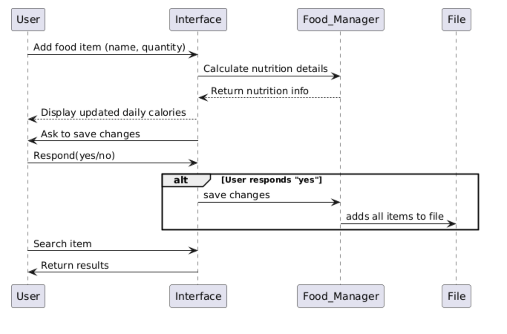
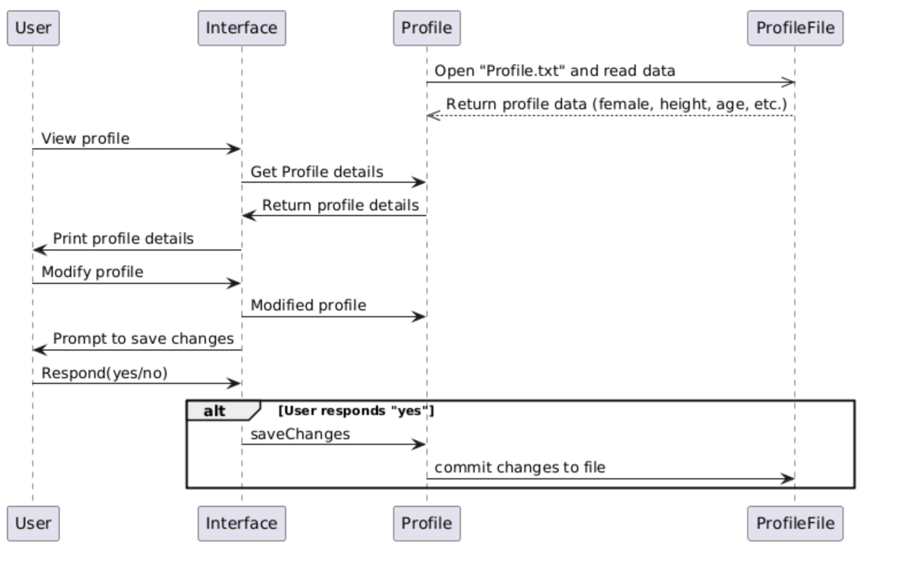
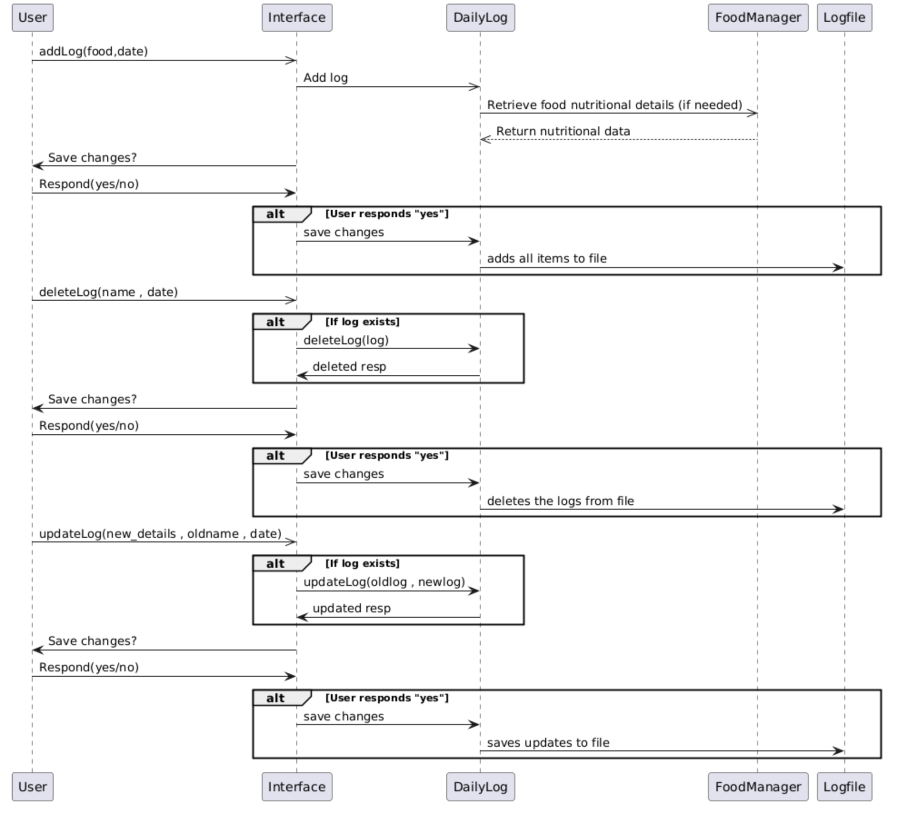
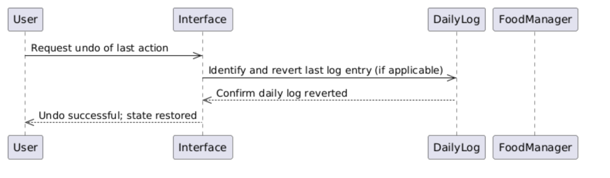

# Design Document for YADA
### Date: 7/4/25
### Team members
Shreyas Kasture 
Roll Number: 2023101083 

Ronit Jalihal 
Roll Number: 2023101028

## Product Overview
### Food add and search
This product is called YADA, Yet Another Diet Assistant. It allows you to add simple (basic) food or complex food which is created using above basic food. You can search for foods using keywords, and the system allows you to choose any number of keywords to use to search for foods. Additionally you can choose when to add these new foods to the database: immediately or when the program exits.

### Profile
This system stores the gender, age, height, weight and activity level of the current user. These details are needed to calculate the target calorie intake. The user can edit their age, weight and activity level everyday, though the default is to carry over the previous values. If the user chooses to edit, the system again asks the user when they want to save the edited data. The target calorie intake is calculated with one of 2 equations: Mifflin_St_Jeor and Harris_Benedict. The user can choose which of these 2 methods the system uses for the calorie intake calculation. 

### Daily Logs

## Division of Work
Ronit Jalihal: Profile, Food 
Shreyas Kasture: Daily Log 
Both: Documentation 

## Sequence Diagrams
### Food functionalities: Add and Search

### Profile functionalities: View and Modify

### Log functionalities: Add , Delete and Update

### Undo Functionality

## Strengths
+ Scalable: High amount of modularity and independence means it is easily scalable. All 3 key design are covered.
+ Efficient: 
+ Easy to Use: User actions are clear ("Add food," "Search"), and feedback is direct ("Display calories").

## Weaknesses
+ Allows only one user
+  Undo functionality only available for daily logs
+ Foods need to have underscore between them if
