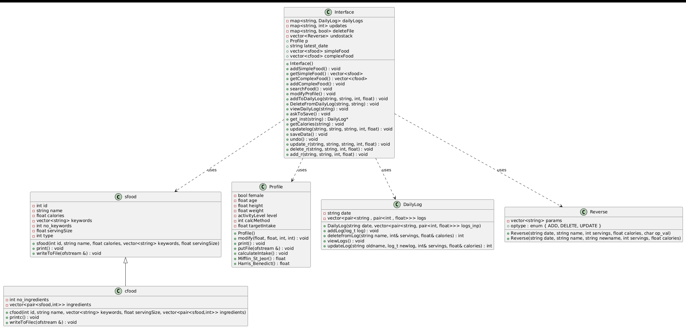

# Design Document for YADA
### Date: 7/4/25
### Team members
Shreyas Kasture 
Roll Number: 2023101083 

Ronit Jalihal 
Roll Number: 2023101028

## Product Overview
### Food add and search
This product is called YADA, Yet Another Diet Assistant. It allows you to add simple (basic) food or complex food which is created using above basic food. You can search for foods using keywords, and the system allows you to choose any number of keywords to use to search for foods. Additionally you can choose when to add these new foods to the database: immediately or when the program exits.

### Profile
This system stores the gender, age, height, weight and activity level of the current user. These details are needed to calculate the target calorie intake. The user can edit their age, weight and activity level everyday, though the default is to carry over the previous values. If the user chooses to edit, the system again asks the user when they want to save the edited data. The target calorie intake is calculated with one of 2 equations: Mifflin_St_Jeor and Harris_Benedict. The user can choose which of these 2 methods the system uses for the calorie intake calculation. 

### Daily Logs
This functionality essentially involves storing and keeping track of all user intake activities. For every date the system maintains a completely independent instance of a DailyLog class , thereby providing the user to access daily logs of any date till today. Moreover , the logs can be updated and viewed by the user by simple commands provided by the interface. On top of that , the user has the freedom to revert back to the previous versions of the daily logs , till the beggining of the session of the application , the attempt for which will lead to the user being notified accordingly.

## Division of Work
Ronit Jalihal: Profile, Food 
Shreyas Kasture: Daily Log 
Both: Documentation 

## Class Diagram

## Sequence Diagrams
### Food functionalities: Add and Search

### Profile functionalities: View and Modify

### Log functionalities: Add , Delete and Update

### Undo Functionality

## Core design principles
### Low Coupling:
Each module (Profile, Food, Daily Log, Undo) is implemented as a self-contained unit with well-defined interfaces. For example, the Profile class manages user data and intake calculation independently of how food or logs are handled. This isolation minimizes changes in one module affecting others.

### High Cohesion:
Every module handles a specific responsibility. The Profile class focuses solely on user data and calorie calculations, while the Food component handles food addition and search, and the Daily Log manages log operations. This focused functionality helps maintain internal consistency and clarity.

### Separation of Concerns (SoC):
The codebase separates different functionalities clearly. Profile manipulation, food management, daily log updates, and undo operations are implemented in separate classes, each responsible for a unique aspect of the system. This separation makes the code more maintainable and easier to understand.

### Information Hiding:
The implementation details of each module are encapsulated within their respective classes. For instance, the Profile class hides the internal calorie calculation logic (Mifflin_St_Jeor and Harris_Benedict methods) behind a public interface. This prevents external components from relying on internal data representations and methods.

### Law of Demeter (LoD):
Objects interact with their immediate collaborators only. In the sequence of operations (e.g., when updating the daily log with food information), each module calls methods on directly related objects rather than traversing multiple layers. This neighbor-only communication restricts unnecessary dependencies and coupling.

## Strengths
+ **Scalable**: 
1. High amount of modularity and independence means it is easily scalable. Every independent component which makes use of the system functionalities has been assigned a class in the system. This clearly demarcates the functionality between all the existing classes , and hence reduces high dependencies. This means any changes in storage / functionality , would simply affect that particular class and nothing else.
2. This allows our system to be scalable to handle the case where instead of the user manually entering the details of all the new foods , which will be tiresome , the food classes namely `sfood` and `cfood` can have additional member methods to add foods in bulk.
3. Now to handle information extraction , the system (here the `class: interface`) can be made to have an instance of a new component of the system (namely a `class: InfoExtractor`) which will be associated with taking information from the website.
4. After extracting this information , this instance of the `info` class will convey the data in the required format to the `sfood` and `cfood` instances , which inturn will invoke the bulk insert functionality. 
5. To add new methods for calculating target calories, the procedure remains quite similar , where you simply need to add newer methods to the class `Profile`.

+ **Efficient**: 
1. After any changes are made to the system , like adding new food items or updating the logs , the changes are stored in a buffer , which will be pushed or reflected in the respective files only if the user wants to explicitly save the changes right after he/she made them , or upon normal exit from the program.
2. The buffer uses efficient data structures like `ordered maps` to optimize search and update functionalities.
3. This way redundant entries are also avoided , since for every date as a key , the object can be simply found from this daily log and changes can be made accordingly. 

+ **Easy to Use**: User actions are clear ("Add food," "Search"), and feedback is direct ("Display calories").

Thus all the key design points are taken care of by the above implementation , also keeping in mind the efficiency and the level of abstraction and complexity provided to the user.

## Weaknesses
+ Allows only one user
+  Undo functionality only available for daily logs
+ Foods need to have underscore between them if it is a name with 2 or more words.
